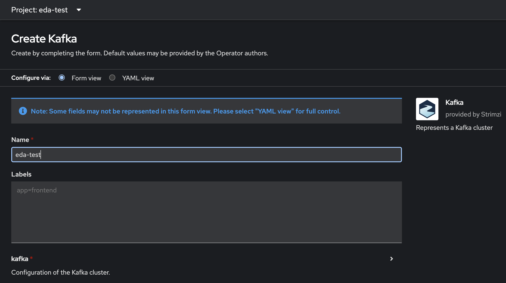
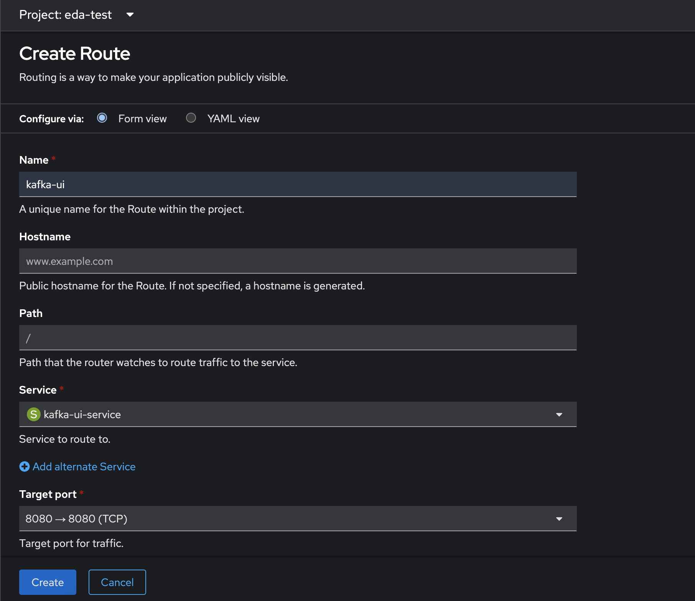
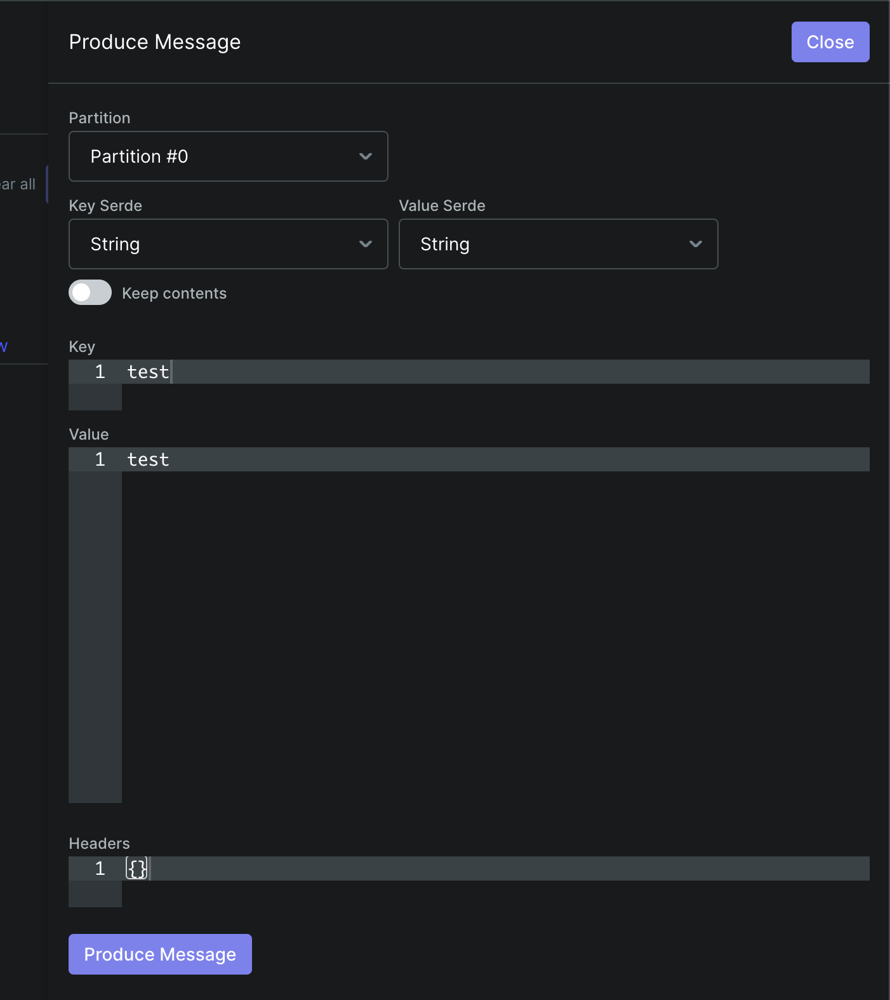

## Event Driven Ansible and Kafka on OpenShift

IMPORTANT: Run commands from directory above this README
TODO: Make image OpenShift and UBI friendly (may exist already)
    - Fix user issues
    - Needs UBI image with Java17+ and Python3

### Setup Kafka
1.  Install Strimzi Kafka operator

        TODO: ADD IMAGE

2.  Create KAFKA INSTANCE NAMED eda-test

    
        Note: Changing the name will require changing KAFKA_HOST environment variable for pods/containers

3. Deploy Kafka UI

    `
    oc apply -f kafka-example/manifests/kafka-ui.yml
    `

4. Create Route for Kafka UI

5. (OPTIONAL)  Test Sending messages

    `
    export BOOTSTRAP_SERVER="eda-test-kafka-bootstrap:9092"
    `

    `
    kubectl -n eda-test run kafka-producer -ti --image=quay.io/strimzi/kafka:0.36.1-kafka-3.5.1 --rm=true --restart=Never -- bin/kafka-console-producer.sh --bootstrap-server $BOOTSTRAP_SERVER --topic kafka-test-topic
    `

6. (OPTIONAL) Test Receiving messages

    `
    kubectl -n eda-test run kafka-consumer -ti --image=quay.io/strimzi/kafka:0.36.1-kafka-3.5.1 --rm=true --restart=Never -- bin/kafka-console-consumer.sh --bootstrap-server $BOOTSTRAP_SERVER --topic kafka-test-topic --from-beginning
    `

7. Build and push container

    `
    podman build -t quay.io/dcurran/eda-kafka-test:latest .
    `

    `
    podman push quay.io/dcurran/eda-kafka-test:latest
    `

8. Create interactive k8s container

    `
    kubectl -n eda-test run eda-test -ti --image=quay.io/dcurran/eda-kafka-test:latest \
        --rm=true --restart=Never \
        --env="KAFKA_HOST=eda-test-kafka-bootstrap.eda-test.svc.cluster.local" \
        --env="KAFKA_PORT=9092" \
        --env="RULEBOOK=kafka-example/rulebook-kafka.yml" -- /bin/bash
    `

9. Run rulebook from k8s container

    `
    ansible-rulebook --rulebook $RULEBOOK -E KAFKA_HOST,KAFKA_PORT -i inventory.yml --verbose
    `

10. Exec into container with separate shell

    `
    kubectl exec eda-test -ti -- /bin/bash
    `

11. Test the webhook

    `
    curl -H 'Content-Type: application/json' -d "{\"message\": \"Ansible is super cool\"}" 127.0.0.1:5000/endpoint
    `

12. Send messages from Kafka-UI or console and view results

    

13. End interactive k8s shells

14. Apply EDA Kafka deployment

    `
    oc apply -f kafka-example/manifests/eda-deployment.yml
    `

15. Test from Kafka-UI

# Appendix

Weird bit of information I had to track down was that according to various tutorials the condition should check for event.message but if you look at running code (i.e. /.ansible/collections/ansible_collections/ansible/eda/extensions/eda/plugins/event_source/kafka.py) it actually sets event.body. However, it's a good example of how to inspect event sources and what they should look like.

# Resources

Kafka resource 1: https://blog.opensight.ch/event-driven-architecture-with-ansible-and-kafka/

Kafka resource 2: https://www.dbi-services.com/blog/ansible-driven-automation-and-kafka/

Kafka resource 3: https://redhat-developer-demos.github.io/kafka-tutorial/kafka-tutorial/1.0.x/07-kubernetes.html

Rules: https://ansible.readthedocs.io/projects/rulebook/en/latest/rules.html

Actions: https://ansible.readthedocs.io/projects/rulebook/en/latest/actions.html

Conditions: https://ansible.readthedocs.io/projects/rulebook/en/latest/conditions.html

